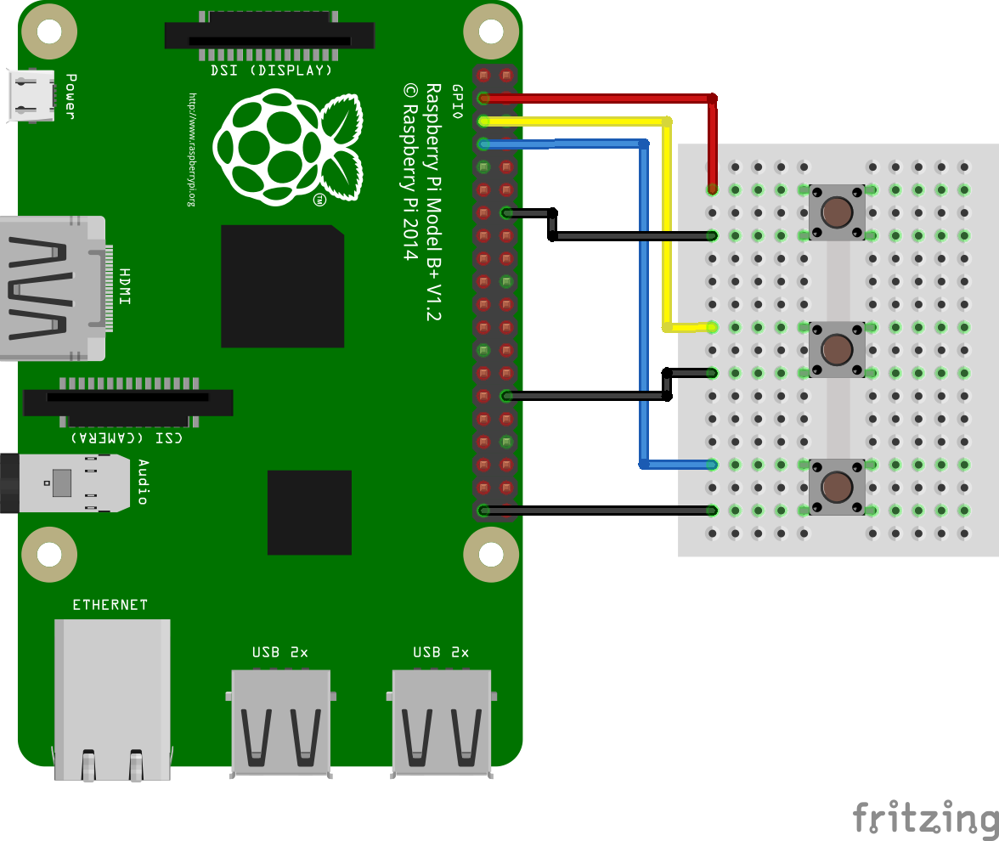

# Project 5 - A Sample Box  

Making music is rather fun, but sometimes just making noise is even better!

Samples are snippets of pre-recorded music that can be inserted into a tune and musicians have used them for many years. 

Samples are designed to be triggered by a simple button press or they can be timed into a song.

In this project we shall create a simple three button interface that will trigger the playback of a sample taken from the library of samples for the Sonic Pi application.

**For this project you will need**

* A Raspberry Pi  
* 3 x Buttons  
* Breadboard  
* A selection of male to female and male to male wires  
* A speaker or monitor with audio  
* The latest version of Raspbian operating system  

  
We start by building the circuit using a breadboard to hold our components together. We place the buttons over the central section of our breadboard. We then choose one leg to connect to ground, often referred to as GND. The other leg connects to a GPIO pin, in this case pins 2,3,4\.

With the wiring completed we now attach are accessories to a Raspberry Pi and boot to the Raspbian desktop.

Now go to the main menu, located in the top left of the screen, and click on Programming » Python 3\.

A new screen will open, in this screen click on File » New Window to open a new editor window. In the new editor window click on File » Save and call your work "samplebox.py"

We start our code by importing a series of modules.

  
*from gpiozero import Button  
import pygame.mixer  
from pygame.mixer import Sound  
from signal import pause*  

  
We use GPIO Zero to handle detecting a button press.

Pygame is a module to create video games with Python, in this case we are using the module and importing its audio playback facilities.

We use pause to wait for the player to press a button.

Next we start the audio mixer built in to Pygame.

  
*pygame.mixer.init()*  

  
Now we create a dictionary which will be used to store the samples used in our code. Using a dictionary we can assign a reference to a sample and use it to load the sample at the press of a button. In this case we use the GPIO pins that our buttons are attached to, as references. So when we press the button attached to GPIO 2 the correct sound is played.

  
*sound\_pins = {  
2: Sound("samples/drum\_tom\_mid\_hard.wav"),  
3: Sound("samples/drum\_cymbal\_open.wav"),  
4: Sound("samples/drum\_heavy\_kick.wav"),  
}*  

  
Next we read the pins into a list.

  
*buttons = \[Button(pin) for pin in sound\_pins\]*  

  
Next we use a for loop that will store the button pressed and then trigger the playback of an audio sample.

  
*for button in buttons:  
sound = sound\_pins\[button.pin.number\]  
button.when\_pressed = sound.play*  

  
Lastly we use a pause to wait for the button press. This prevents the code from exiting which would stop our project.

  
*pause()*

  
With our code created we can now save our work. 

To start the project click on Run » Run Module. After a few seconds press the buttons to play the samples.

This project can be extended to include more buttons and samples.
